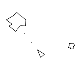

Another previously started toy project to help me improve. This time it's around genetic algorithms and neural networks. It's been a long time since I wanted to play with genetic algorithms and since I wanted to know more about the core principles behind our modern so called AI. So I thought it would be nice to try a Node-based implementation of the NEAT Algorithm. It seemed an ambitious yet accessible project combining 2 notions I wanted to learn in depth.

[Link to the project.](https://github.com/0xRemyRuiz/HTML5-asteroids-NEAT)

## The first step

My first step was to get a web game already made preferably in HTML5. I found the [HTML 5 Asteroids by Doug McInnes](http://www.dougmcinnes.com/2010/05/12/html-5-asteroids)  which looked very nice although it was kinda old. I knew I first needed to manually go through the code to implant the necessary hooks so I could script a few commands and extract the necessary information. In the process I could see the code wasn't very clean at all but I kept my modifications to a minimum. Once I managed to hook controls I got into the process of scanning the playground. That was something. Much more challenging than expected. Again I'm no math guy and I do not like at all playing with graphical/geometric maths. So I was bashing my head hard on trigonometry. At the time I didn't use AI at all. My goal was to feed my AI some crucial data.

 - Orientation
 - Velocity
 - Nearest enemies

So "Orientation" is somewhat trivial since I could use any convention I'd like as long as I remain consistent. Turns out that rotation had already been included in the game so when you move your ship the game knows where it's steering. Velocity was also already a thing but I had to dial it down a little bit (round it to 8 digits after the decimal point). If I remember correctly it was to optimize calculations which were becoming heavy.

In that regard, nearest enemies classification was my main focus and biggest hurdle. At first I thought I only had to list the nearest enemies from the game's list of objects. But I quickly realized I needed to calculate distances using trigonometry so I could arrange the enemies by order of proximity. So I did that pretty quickly to my surprise. I had to go through all objects that were not my own bullets or my ship, calculate the distance and then sort. Although...I must admit I had a bit of a headache as soon as I realized that hypotenuse calculation wasn't always the same when an object was in one of the 4 possible sectors relative to the ship's position. Now to debug, I just had to trace a short straight line to the nearest enemy and see if this works right?

__*Video 1*__

I have a problem, the asteroids are appearing on the opposite side when they disappear...classical asteroids gameplay. Although rendering doesn't seem perfect we won't try to make it better, also because collision is based on polygon detection so if the polygon hasn't been rendered, we cannot collide with it. Here is the code (almost unchanged by me).

```javascript
  this.checkCollision = function (other) {
    // Code here is ommitted...
    for (var i = 0; i < count; i++) {
      // Code here is ommitted...
      if (this.pointInPolygon(px, py)) {
        other.collision(this);
        this.collision(other);
        return;
      }
    }
  };
```

This is interesting but where do we go from that? Well, we absolutely need a way to estimate the nearest enemies no matter what. We need a way to determine if an object was closer to us from another "virtual" side. For instance, if the asteroid was on the right side and our ship on the left, the closest distance to it is not the entire screen but a few pixels to our left. But how? Well, I found a very costly but very efficient way to do it. Add 4 virtual positions to every object. Sounds bad right? It does but I'm not very sure I can do it otherwise so...

__*Video 2*__

It works perfectly! Let's consider the game system hooked correctly and move on to the next step, building the algorithm.

## Things start to get hairy

Okay, now we can safely start to look at the NEAT algorithm implementation details. We need tutorials and documentation. I've heard neurons are simple in design and are only a conversion function taking input(s) and getting a single output signal. So let's go back to maths and build (I mean copy from others) us a math function visualization. That way we can visually verify we are on the right tracks. And then we dive into the NEAT paper.

At that point I decided, since I was entering uncharted territory and with my last disappointment, that I needed a git repo and so I did it.

I started searching the web more for documentation and potentially interesting tutorials. I already did this work before modifying the game though. And one of the reasons I started this project the way I did is, at the time, I thought I had found serious and simple to follow tutorials on how to implement the NEAT algorithm. However, as I accumulated the documentation and started to implement naively the base of the algorithm, I realized there was something off. One of my main sources (which won't be cited here), pretending to provide a tutorial on how to solve a game using NEAT and building the algorithm from scratch, was just garbage. That taught me to not trust articles from Medium (the website) and treat them like the rest of the internet.

I started implementing the NEAT algorithm like I thought I should. After that, I laid down the foundation for a client/server architecture, both to have a pluggable (decoupled) environment and to let multiple clients play simultaneously (and yes I forgot Node was single-threaded). It would become my test environment, my operational center on which I could see the progress. It was unnecessarily complicated and even now, when I want to show off my prowess, I have to read through my README instructions to remember how to set up the interface... But, after a month trying hard on my own (I had free time but I was also doing LeetCode in parallel), I started to wonder if I could do it in a short period of time.

I read in the original paper that debugging the implementation using the XOR mini game was a good initiative, and it can also serve as a benchmark. So I implemented a special client to "play" this XOR game and visualize the evolution of the neural network throughout generations. It helped debug my algorithm tremendously but, unfortunately, it also showed I was nowhere near a working solution. I tried to look at [CodeReclaimers' own configuration](https://github.com/CodeReclaimers/neat-python/tree/5fd31422e16ba09a2ff33327ecf5ccd75997208f/examples/xor) but did not really nail the specific part I was missing. I had no real idea where to look for a resolution.

So I started using ChatGPT (4o just came out and was "close to AGI" lol) as a tutor to help me deep dive into the algorithm. One particular notion I knew I had to investigate wasn't even in the original research paper. _How do neural networks...work?_ I mean, I learned that a neuron is a math function and that you pass each "sensory" value (i.e., direction, orientation, nearest enemies, etc.) as an input to one or multiple neurons but how do they "chew" on them. I started learning about aggregation and "feed forward" mechanisms. At that point I started using ChatGPT to speed up my learning process and it worked well. It generated Python script examples from time to time and I was okay with it since it forced me to "translate" the code to my JavaScript context and since I was relatively well versed in both I could do it manually and quickly. I even started to ask trickier questions like «`Can I ask you what the ẟt value is? It is supposed to be the threshold below which is associated to a specific specie. How this value is set? To which number?`» coming directly from the paper by Kenneth O. Stanley and Risto Miikkulainen. I also worked to understand various fascinating notions such as bias, speciation, crossover, fitness sharing, mating strategy, etc.

## And then I had to stop

I indeed had to stop. I spent nearly 4 months on this toy project. And even though I didn't work on it full-time, I spent many hours trying to understand scientific papers and Python implementations partly by myself. Moreover, after debugging and researching, I was starting to understand what I was doing wrong. I also knew the solution was a long shot. I do like to finish my projects and I really tried to — I put in time and effort and wrote many lines of code. I never planned on getting an education to have a career in AI. My primary goals were indeed complete.

 [V] better understand genetic algorithms
 [V] better understand neural networks
 [V] do something and get even better in dev

__Sometimes, stopping is the healthy option.__

## Wait...it's part 1 right?

Yeah. Although I stopped my project, I know, in the future, I will complete it and be proud. Until then, have a good one!

## Notes
 - Human written article
 - Article originally written in english
 - Minor AI correction suggestion applied
